# Model Training

### Assignment 7:

- Achieve 99.4 % test accuracy atleast for lat 4 epochs in minist dataset
- Achieve it under 15 epochs
- Achieve it under 8000 parameters
- The code should be modulaized with the help of utils.py and models.py

## Code 1 - Set up

### Target:
- Get the set-up right
- Set Transforms
- Set Data Loader
- Set Basic Working Code
- Set Basic Training & Test Loop

### Results:
- Parameters: 6.3M
- Best Training Accuracy: 99.85
- Best Test Accuracy: 99.06

```python
----------------------------------------------------------------
        Layer (type)               Output Shape         Param #
================================================================
            Conv2d-1           [-1, 32, 28, 28]             320
            Conv2d-2           [-1, 64, 28, 28]          18,496
         MaxPool2d-3           [-1, 64, 14, 14]               0
            Conv2d-4          [-1, 128, 14, 14]          73,856
            Conv2d-5          [-1, 256, 14, 14]         295,168
         MaxPool2d-6            [-1, 256, 7, 7]               0
            Conv2d-7            [-1, 512, 5, 5]       1,180,160
            Conv2d-8           [-1, 1024, 3, 3]       4,719,616
            Conv2d-9             [-1, 10, 1, 1]          92,170
================================================================
Total params: 6,379,786
Trainable params: 6,379,786
Non-trainable params: 0
----------------------------------------------------------------
Input size (MB): 0.00
Forward/backward pass size (MB): 1.51
Params size (MB): 24.34
Estimated Total Size (MB): 25.85
----------------------------------------------------------------
```

### Analysis:
- Extremely Heavy Model for such a problem
- Model is over-fitting, 
- Basic data augmentations is done
- Need to change model in next step

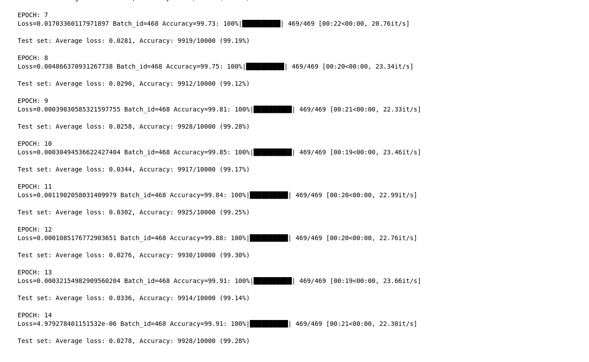

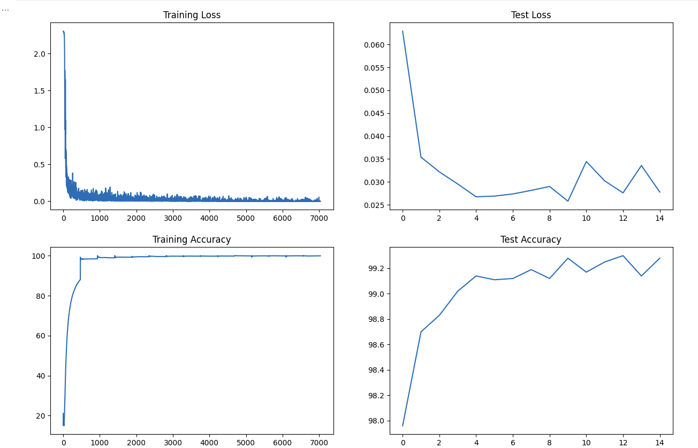


## Code 2 - Basic Skeleton

### Target:
- Make basic skeleton right and will avoid changing this skeleton as much as possible.
- No fancy stuff

### Results:
- Parameters: 194k
- Best Train Accuracy: 99.27
- Best Test Accuracy: 98.86

```python
----------------------------------------------------------------
        Layer (type)               Output Shape         Param #
================================================================
            Conv2d-1           [-1, 32, 26, 26]             288
              ReLU-2           [-1, 32, 26, 26]               0
            Conv2d-3           [-1, 64, 24, 24]          18,432
              ReLU-4           [-1, 64, 24, 24]               0
            Conv2d-5          [-1, 128, 22, 22]          73,728
              ReLU-6          [-1, 128, 22, 22]               0
         MaxPool2d-7          [-1, 128, 11, 11]               0
            Conv2d-8           [-1, 32, 11, 11]           4,096
              ReLU-9           [-1, 32, 11, 11]               0
           Conv2d-10             [-1, 64, 9, 9]          18,432
             ReLU-11             [-1, 64, 9, 9]               0
           Conv2d-12            [-1, 128, 7, 7]          73,728
             ReLU-13            [-1, 128, 7, 7]               0
           Conv2d-14             [-1, 10, 7, 7]           1,280
             ReLU-15             [-1, 10, 7, 7]               0
           Conv2d-16             [-1, 10, 1, 1]           4,900
================================================================
Total params: 194,884
Trainable params: 194,884
Non-trainable params: 0
----------------------------------------------------------------
Input size (MB): 0.00
Forward/backward pass size (MB): 2.20
Params size (MB): 0.74
Estimated Total Size (MB): 2.94
----------------------------------------------------------------
```
### Analysis:
- The model is still large, but working.
- Some Overfitting is seen

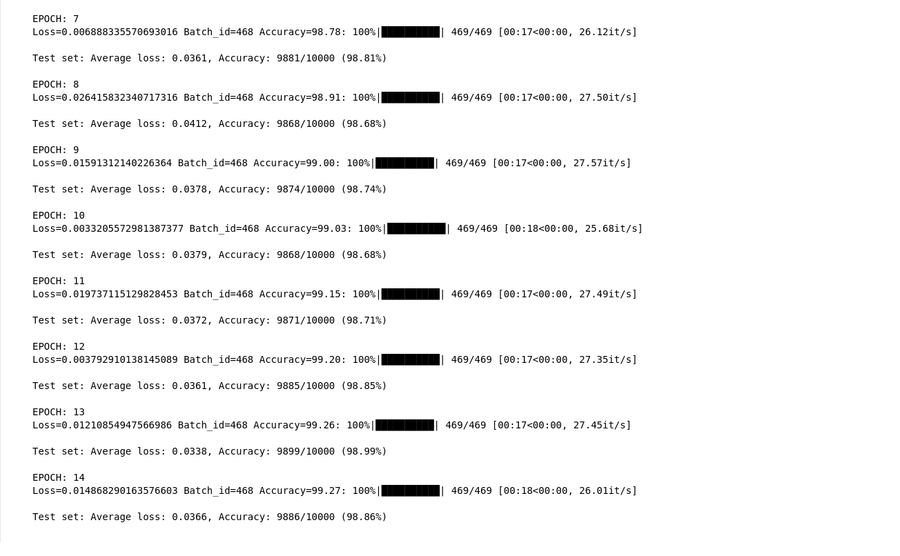

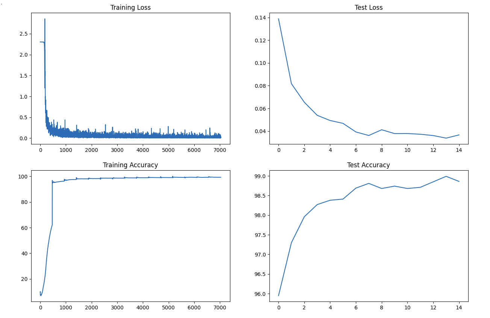

## Code 3 - Lighter Model

### Target:
- Need to make model lighter

### Results:
- Parameters: 10.7k
- Best Train Accuracy: 98.88
- Best Test Accuracy: 98.82

```python
----------------------------------------------------------------
        Layer (type)               Output Shape         Param #
================================================================
            Conv2d-1           [-1, 10, 26, 26]              90
              ReLU-2           [-1, 10, 26, 26]               0
            Conv2d-3           [-1, 10, 24, 24]             900
              ReLU-4           [-1, 10, 24, 24]               0
            Conv2d-5           [-1, 20, 22, 22]           1,800
              ReLU-6           [-1, 20, 22, 22]               0
         MaxPool2d-7           [-1, 20, 11, 11]               0
            Conv2d-8           [-1, 10, 11, 11]             200
              ReLU-9           [-1, 10, 11, 11]               0
           Conv2d-10             [-1, 10, 9, 9]             900
             ReLU-11             [-1, 10, 9, 9]               0
           Conv2d-12             [-1, 20, 7, 7]           1,800
             ReLU-13             [-1, 20, 7, 7]               0
           Conv2d-14             [-1, 10, 7, 7]             200
             ReLU-15             [-1, 10, 7, 7]               0
           Conv2d-16             [-1, 10, 1, 1]           4,900
================================================================
Total params: 10,790
Trainable params: 10,790
Non-trainable params: 0
----------------------------------------------------------------
Input size (MB): 0.00
Forward/backward pass size (MB): 0.41
Params size (MB): 0.04
Estimated Total Size (MB): 0.45
----------------------------------------------------------------
```

### Analysis:
- Light weight model
- No over-fitting seen and can be pushed further

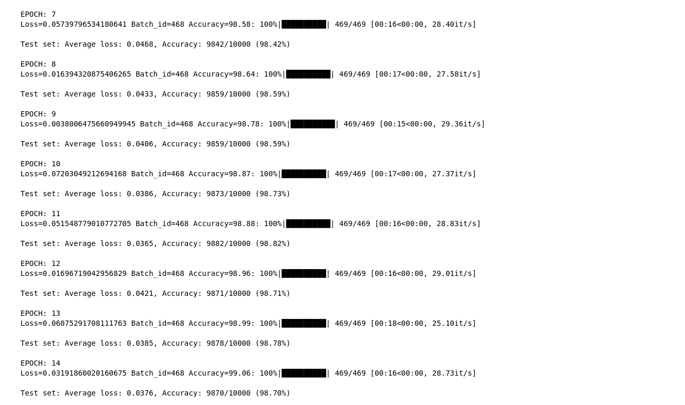

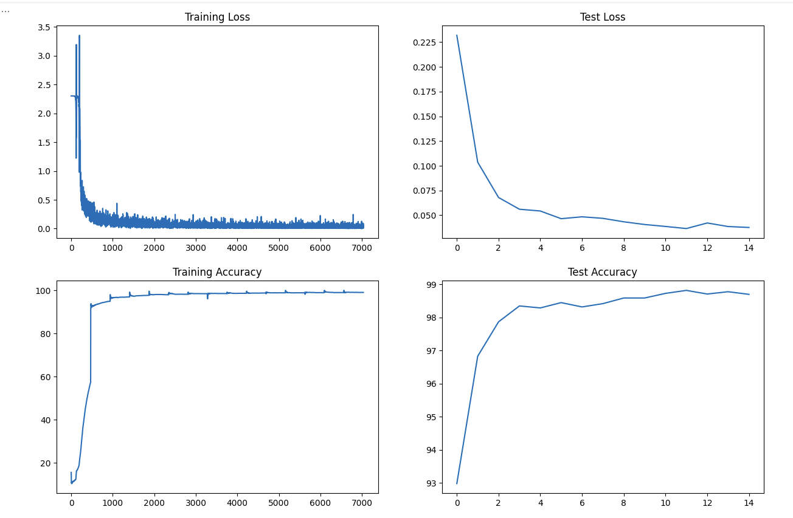

## Code 4 - Batch Normalization

### Target:
- Need to make model efficient by using batch normalization

### Results:
- Parameters: 10.7k
- Best Train Accuracy: 99.75
- Best Test Accuracy: 98.28

```python
----------------------------------------------------------------
        Layer (type)               Output Shape         Param #
================================================================
            Conv2d-1           [-1, 10, 26, 26]              90
       BatchNorm2d-2           [-1, 10, 26, 26]              20
              ReLU-3           [-1, 10, 26, 26]               0
            Conv2d-4           [-1, 10, 24, 24]             900
       BatchNorm2d-5           [-1, 10, 24, 24]              20
              ReLU-6           [-1, 10, 24, 24]               0
            Conv2d-7           [-1, 20, 22, 22]           1,800
       BatchNorm2d-8           [-1, 20, 22, 22]              40
              ReLU-9           [-1, 20, 22, 22]               0
        MaxPool2d-10           [-1, 20, 11, 11]               0
           Conv2d-11           [-1, 10, 11, 11]             200
      BatchNorm2d-12           [-1, 10, 11, 11]              20
             ReLU-13           [-1, 10, 11, 11]               0
           Conv2d-14             [-1, 10, 9, 9]             900
      BatchNorm2d-15             [-1, 10, 9, 9]              20
             ReLU-16             [-1, 10, 9, 9]               0
           Conv2d-17             [-1, 20, 7, 7]           1,800
      BatchNorm2d-18             [-1, 20, 7, 7]              40
             ReLU-19             [-1, 20, 7, 7]               0
           Conv2d-20             [-1, 10, 7, 7]             200
      BatchNorm2d-21             [-1, 10, 7, 7]              20
             ReLU-22             [-1, 10, 7, 7]               0
           Conv2d-23             [-1, 10, 1, 1]           4,900
================================================================
Total params: 10,970
Trainable params: 10,970
Non-trainable params: 0
----------------------------------------------------------------
Input size (MB): 0.00
Forward/backward pass size (MB): 0.61
Params size (MB): 0.04
Estimated Total Size (MB): 0.65
----------------------------------------------------------------
```

### Analysis:
- Need to find techinque to achieve the 99.4% accuracy, But model can be pushed further

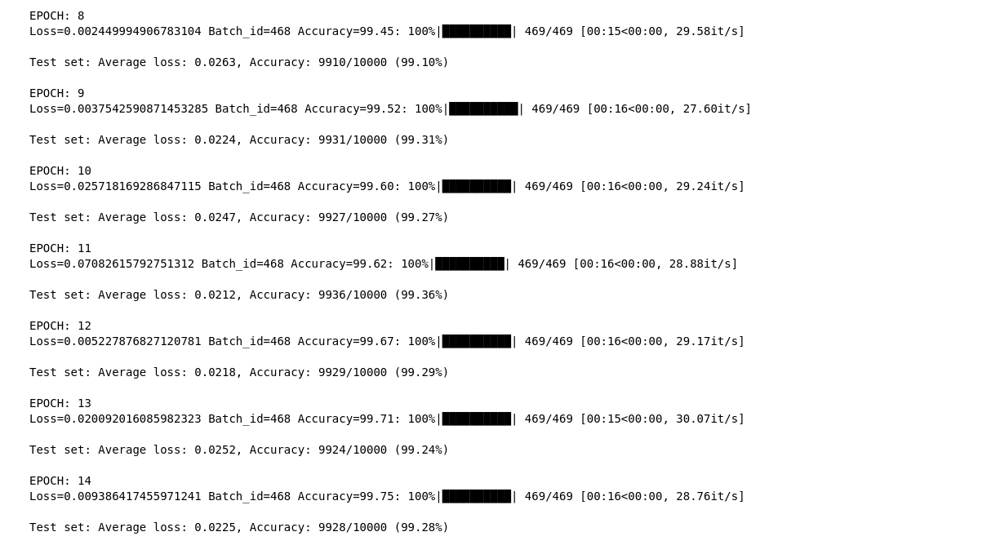

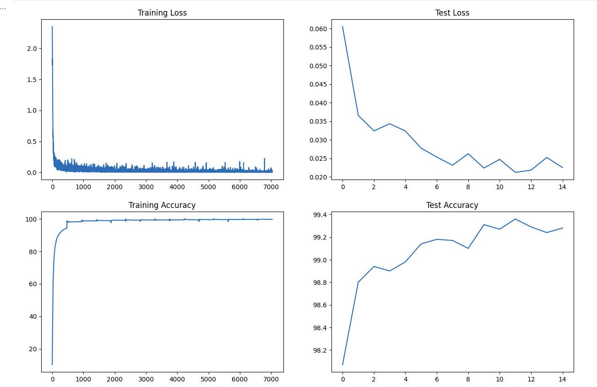

## Code 5 - Regularization

### Target:

- Add Regularization and dropout

### Results:

- Parameters: 10970
- Best Training Accuracy: 99.81
- Best Test Accuracy: 99.28

```python
----------------------------------------------------------------
        Layer (type)               Output Shape         Param #
================================================================
            Conv2d-1           [-1, 10, 26, 26]              90
       BatchNorm2d-2           [-1, 10, 26, 26]              20
              ReLU-3           [-1, 10, 26, 26]               0
            Conv2d-4           [-1, 10, 24, 24]             900
       BatchNorm2d-5           [-1, 10, 24, 24]              20
              ReLU-6           [-1, 10, 24, 24]               0
            Conv2d-7           [-1, 20, 22, 22]           1,800
       BatchNorm2d-8           [-1, 20, 22, 22]              40
              ReLU-9           [-1, 20, 22, 22]               0
          Dropout-10           [-1, 20, 22, 22]               0
        MaxPool2d-11           [-1, 20, 11, 11]               0
           Conv2d-12           [-1, 10, 11, 11]             200
      BatchNorm2d-13           [-1, 10, 11, 11]              20
             ReLU-14           [-1, 10, 11, 11]               0
           Conv2d-15             [-1, 10, 9, 9]             900
      BatchNorm2d-16             [-1, 10, 9, 9]              20
             ReLU-17             [-1, 10, 9, 9]               0
           Conv2d-18             [-1, 20, 7, 7]           1,800
      BatchNorm2d-19             [-1, 20, 7, 7]              40
             ReLU-20             [-1, 20, 7, 7]               0
          Dropout-21             [-1, 20, 7, 7]               0
           Conv2d-22             [-1, 10, 7, 7]             200
      BatchNorm2d-23             [-1, 10, 7, 7]              20
             ReLU-24             [-1, 10, 7, 7]               0
           Conv2d-25             [-1, 10, 1, 1]           4,900
================================================================
Total params: 10,970
Trainable params: 10,970
Non-trainable params: 0
----------------------------------------------------------------
Input size (MB): 0.00
Forward/backward pass size (MB): 0.69
Params size (MB): 0.04
Estimated Total Size (MB): 0.73
----------------------------------------------------------------
```

### Analysis:
- Regularization working as expected.
- Need to lower the parameters to meet 8k.
- Instead to GAP, large kernal is used
- Some overfitting is seen in last layers
- Model can be pushed further

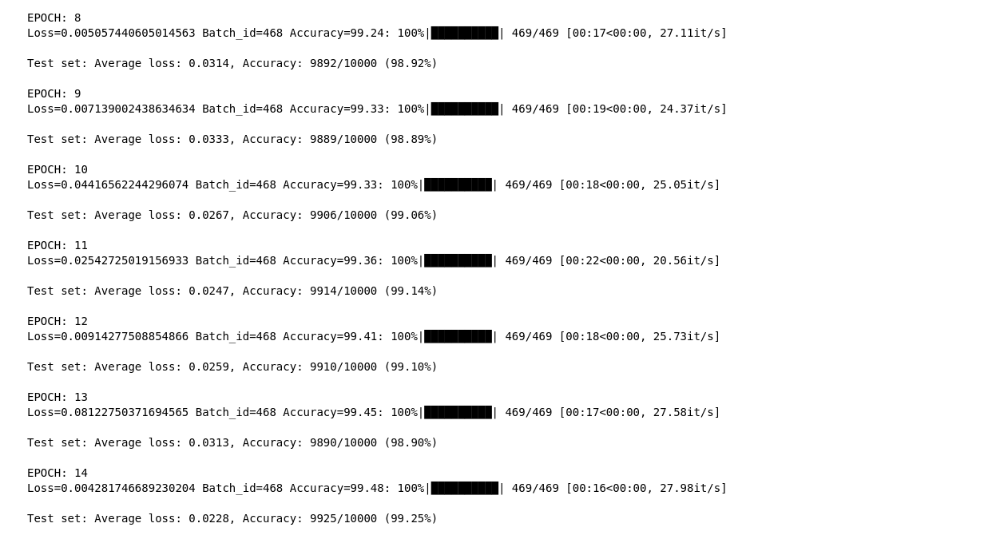

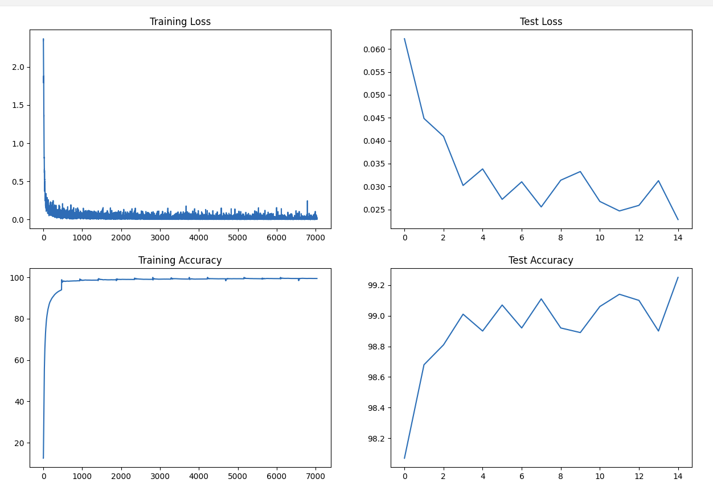

## Code 6 - Global Average Pooling

### Target:

- Add GAP and remove 7*7 Conv at the end

### Results:

- Parameters: 6070
- Best Training Accuracy: 98.81
- Best Test Accuracy: 98.72

```python
----------------------------------------------------------------
        Layer (type)               Output Shape         Param #
================================================================
            Conv2d-1           [-1, 10, 26, 26]              90
       BatchNorm2d-2           [-1, 10, 26, 26]              20
              ReLU-3           [-1, 10, 26, 26]               0
            Conv2d-4           [-1, 10, 24, 24]             900
       BatchNorm2d-5           [-1, 10, 24, 24]              20
              ReLU-6           [-1, 10, 24, 24]               0
            Conv2d-7           [-1, 20, 22, 22]           1,800
       BatchNorm2d-8           [-1, 20, 22, 22]              40
              ReLU-9           [-1, 20, 22, 22]               0
          Dropout-10           [-1, 20, 22, 22]               0
        MaxPool2d-11           [-1, 20, 11, 11]               0
           Conv2d-12           [-1, 10, 11, 11]             200
      BatchNorm2d-13           [-1, 10, 11, 11]              20
             ReLU-14           [-1, 10, 11, 11]               0
           Conv2d-15             [-1, 10, 9, 9]             900
      BatchNorm2d-16             [-1, 10, 9, 9]              20
             ReLU-17             [-1, 10, 9, 9]               0
           Conv2d-18             [-1, 20, 7, 7]           1,800
      BatchNorm2d-19             [-1, 20, 7, 7]              40
             ReLU-20             [-1, 20, 7, 7]               0
          Dropout-21             [-1, 20, 7, 7]               0
           Conv2d-22             [-1, 10, 7, 7]             200
      BatchNorm2d-23             [-1, 10, 7, 7]              20
             ReLU-24             [-1, 10, 7, 7]               0
        AvgPool2d-25             [-1, 10, 1, 1]               0
================================================================
Total params: 6,070
Trainable params: 6,070
Non-trainable params: 0
----------------------------------------------------------------
Input size (MB): 0.00
Forward/backward pass size (MB): 0.69
Params size (MB): 0.02
Estimated Total Size (MB): 0.71
----------------------------------------------------------------
```
### Analysis:
- Due to reduction in parameter from 10k in previous exp. t0 6k causes falls in accuracy.
- Also GAP is not impacting in fall in accuracy
- No Overfitting seen except last layer
- In next experiment we will increase capacity in such a way that parameters are below 8k and accuracy is 99+


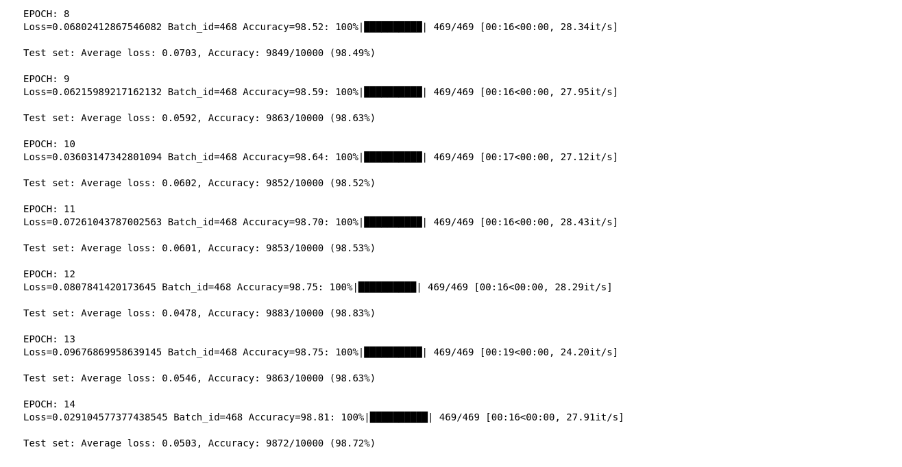

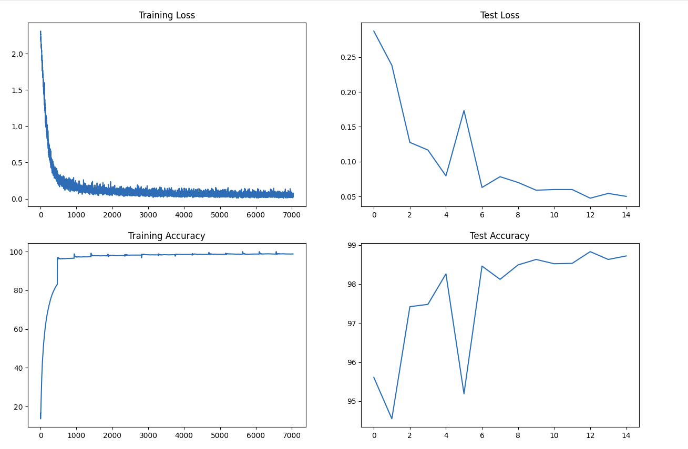

## Code 7 - Increasing Capacity

### Target:

- Increase the model's capacity by altering structure like reducing numer of channel
- Add 1*1 Conv layer after GAP and after 4th conv
- Maintain the parameters below 8k
- Reduce batch size to 64

### Results:

- Parameters: 7,884
- Best Training Accuracy: 99.23
- Best Test Accuracy: 99.23

```python
----------------------------------------------------------------
        Layer (type)               Output Shape         Param #
================================================================
            Conv2d-1           [-1, 10, 26, 26]              90
              ReLU-2           [-1, 10, 26, 26]               0
       BatchNorm2d-3           [-1, 10, 26, 26]              20
            Conv2d-4           [-1, 10, 24, 24]             900
              ReLU-5           [-1, 10, 24, 24]               0
       BatchNorm2d-6           [-1, 10, 24, 24]              20
            Conv2d-7           [-1, 10, 22, 22]             900
              ReLU-8           [-1, 10, 22, 22]               0
       BatchNorm2d-9           [-1, 10, 22, 22]              20
          Dropout-10           [-1, 10, 22, 22]               0
           Conv2d-11           [-1, 10, 20, 20]             900
      BatchNorm2d-12           [-1, 10, 20, 20]              20
           Conv2d-13           [-1, 10, 20, 20]             100
      BatchNorm2d-14           [-1, 10, 20, 20]              20
        MaxPool2d-15           [-1, 10, 10, 10]               0
           Conv2d-16             [-1, 14, 8, 8]           1,260
             ReLU-17             [-1, 14, 8, 8]               0
      BatchNorm2d-18             [-1, 14, 8, 8]              28
           Conv2d-19             [-1, 14, 6, 6]           1,764
             ReLU-20             [-1, 14, 6, 6]               0
      BatchNorm2d-21             [-1, 14, 6, 6]              28
          Dropout-22             [-1, 14, 6, 6]               0
           Conv2d-23             [-1, 13, 4, 4]           1,638
      BatchNorm2d-24             [-1, 13, 4, 4]              26
AdaptiveAvgPool2d-25             [-1, 13, 1, 1]               0
           Conv2d-26             [-1, 10, 1, 1]             130
      BatchNorm2d-27             [-1, 10, 1, 1]              20
================================================================
Total params: 7,884
Trainable params: 7,884
Non-trainable params: 0
----------------------------------------------------------------
Input size (MB): 0.00
Forward/backward pass size (MB): 0.60
Params size (MB): 0.03
Estimated Total Size (MB): 0.64
----------------------------------------------------------------
```

### Analysis:
- Model is consistently achieving 99.2+ accuracy on 10 epochs onwards
- May be be dropout is not working
- Overfitting is not seen on 10 epochs onwards
- Model can be push further

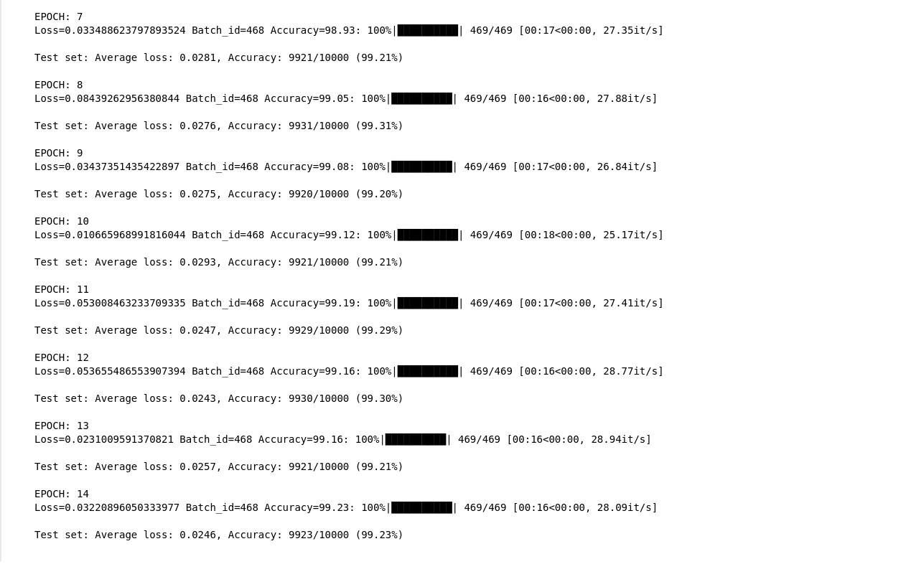

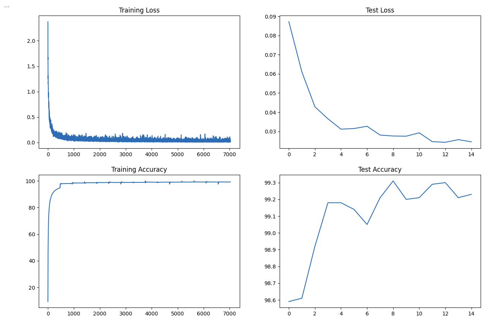

## Code 8 - Correct MaxPooling Location

### Target:

- Fix dropout, alter max pool

### Results:

- Parameters: 7,884
- Best Training Accuracy: 99.34
- Best Test Accuracy: 99.36

```python
----------------------------------------------------------------
        Layer (type)               Output Shape         Param #
================================================================
            Conv2d-1           [-1, 10, 26, 26]              90
              ReLU-2           [-1, 10, 26, 26]               0
       BatchNorm2d-3           [-1, 10, 26, 26]              20
            Conv2d-4           [-1, 10, 24, 24]             900
              ReLU-5           [-1, 10, 24, 24]               0
       BatchNorm2d-6           [-1, 10, 24, 24]              20
            Conv2d-7           [-1, 10, 22, 22]             900
              ReLU-8           [-1, 10, 22, 22]               0
       BatchNorm2d-9           [-1, 10, 22, 22]              20
           Conv2d-10           [-1, 10, 20, 20]             900
      BatchNorm2d-11           [-1, 10, 20, 20]              20
           Conv2d-12           [-1, 10, 20, 20]             100
      BatchNorm2d-13           [-1, 10, 20, 20]              20
        MaxPool2d-14           [-1, 10, 10, 10]               0
           Conv2d-15             [-1, 14, 8, 8]           1,260
             ReLU-16             [-1, 14, 8, 8]               0
      BatchNorm2d-17             [-1, 14, 8, 8]              28
           Conv2d-18             [-1, 14, 6, 6]           1,764
             ReLU-19             [-1, 14, 6, 6]               0
      BatchNorm2d-20             [-1, 14, 6, 6]              28
           Conv2d-21             [-1, 13, 4, 4]           1,638
      BatchNorm2d-22             [-1, 13, 4, 4]              26
AdaptiveAvgPool2d-23             [-1, 13, 1, 1]               0
           Conv2d-24             [-1, 10, 1, 1]             130
      BatchNorm2d-25             [-1, 10, 1, 1]              20
================================================================
Total params: 7,884
Trainable params: 7,884
Non-trainable params: 0
----------------------------------------------------------------
Input size (MB): 0.00
Forward/backward pass size (MB): 0.56
Params size (MB): 0.03
Estimated Total Size (MB): 0.60
----------------------------------------------------------------
```
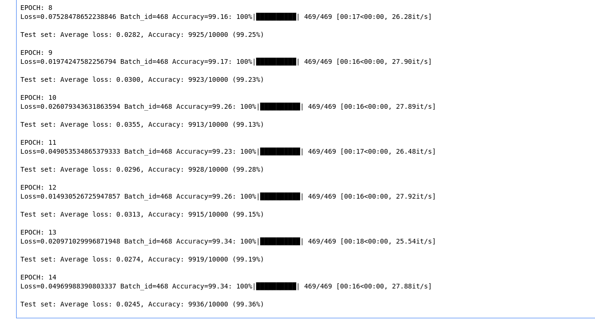

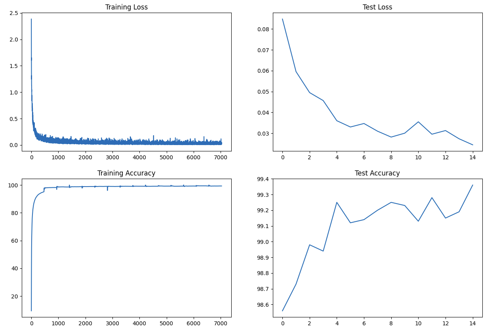

### Analysis:
- Model is consistently achieving 99.2+ accuracy on 10 epochs onwards
- No max pool alteration is done.
- Removing droupt has increased the accuracy from 99.23(previous training) to 99.36(current training)
- Model can be pushed further

## Code 9 - Image Augmentation

### Target:

- Add rotation, 5-7 degrees should be sufficient.

### Results:

- Parameters: 7,884
- Best Training Accuracy: 99.31
- Best Test Accuracy: 99.27

```python
----------------------------------------------------------------
        Layer (type)               Output Shape         Param #
================================================================
            Conv2d-1           [-1, 10, 26, 26]              90
              ReLU-2           [-1, 10, 26, 26]               0
       BatchNorm2d-3           [-1, 10, 26, 26]              20
            Conv2d-4           [-1, 10, 24, 24]             900
              ReLU-5           [-1, 10, 24, 24]               0
       BatchNorm2d-6           [-1, 10, 24, 24]              20
            Conv2d-7           [-1, 10, 22, 22]             900
              ReLU-8           [-1, 10, 22, 22]               0
       BatchNorm2d-9           [-1, 10, 22, 22]              20
           Conv2d-10           [-1, 10, 20, 20]             900
      BatchNorm2d-11           [-1, 10, 20, 20]              20
           Conv2d-12           [-1, 10, 20, 20]             100
      BatchNorm2d-13           [-1, 10, 20, 20]              20
        MaxPool2d-14           [-1, 10, 10, 10]               0
           Conv2d-15             [-1, 14, 8, 8]           1,260
             ReLU-16             [-1, 14, 8, 8]               0
      BatchNorm2d-17             [-1, 14, 8, 8]              28
           Conv2d-18             [-1, 14, 6, 6]           1,764
             ReLU-19             [-1, 14, 6, 6]               0
      BatchNorm2d-20             [-1, 14, 6, 6]              28
           Conv2d-21             [-1, 13, 4, 4]           1,638
      BatchNorm2d-22             [-1, 13, 4, 4]              26
AdaptiveAvgPool2d-23             [-1, 13, 1, 1]               0
           Conv2d-24             [-1, 10, 1, 1]             130
      BatchNorm2d-25             [-1, 10, 1, 1]              20
================================================================
Total params: 7,884
Trainable params: 7,884
Non-trainable params: 0
----------------------------------------------------------------
Input size (MB): 0.00
Forward/backward pass size (MB): 0.56
Params size (MB): 0.03
Estimated Total Size (MB): 0.60
----------------------------------------------------------------
```

### Analysis:
- Model is consistently achieving 99.15+ accuracy on 10 epochs onwards
- There is drop in accuracy from last training, may be becuase of data augumentation, but we will push to next.

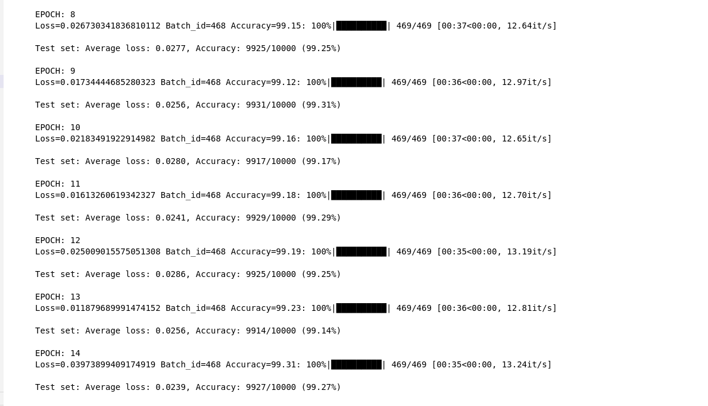

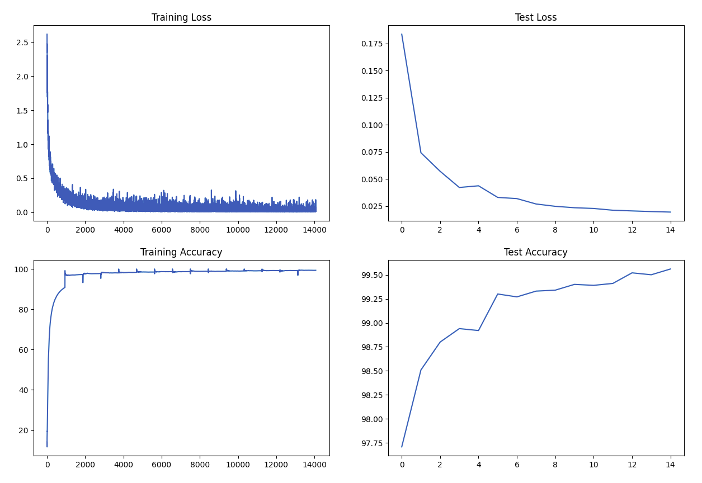


## Code 10 - Playing naively with Learning Rates

### Target:

- Add OneCycle LR scheduler to achieve the target og 99.4 in 15 epoch and leow 8k params

### Results:

- Parameters: 7,884
- Best Training Accuracy: 99.34
- Best Test Accuracy: 99.56

```python
----------------------------------------------------------------
        Layer (type)               Output Shape         Param #
================================================================
            Conv2d-1           [-1, 10, 26, 26]              90
              ReLU-2           [-1, 10, 26, 26]               0
       BatchNorm2d-3           [-1, 10, 26, 26]              20
            Conv2d-4           [-1, 10, 24, 24]             900
              ReLU-5           [-1, 10, 24, 24]               0
       BatchNorm2d-6           [-1, 10, 24, 24]              20
            Conv2d-7           [-1, 10, 22, 22]             900
              ReLU-8           [-1, 10, 22, 22]               0
       BatchNorm2d-9           [-1, 10, 22, 22]              20
           Conv2d-10           [-1, 10, 20, 20]             900
      BatchNorm2d-11           [-1, 10, 20, 20]              20
           Conv2d-12           [-1, 10, 20, 20]             100
      BatchNorm2d-13           [-1, 10, 20, 20]              20
        MaxPool2d-14           [-1, 10, 10, 10]               0
           Conv2d-15             [-1, 14, 8, 8]           1,260
             ReLU-16             [-1, 14, 8, 8]               0
      BatchNorm2d-17             [-1, 14, 8, 8]              28
           Conv2d-18             [-1, 14, 6, 6]           1,764
             ReLU-19             [-1, 14, 6, 6]               0
      BatchNorm2d-20             [-1, 14, 6, 6]              28
           Conv2d-21             [-1, 13, 4, 4]           1,638
      BatchNorm2d-22             [-1, 13, 4, 4]              26
AdaptiveAvgPool2d-23             [-1, 13, 1, 1]               0
           Conv2d-24             [-1, 10, 1, 1]             130
      BatchNorm2d-25             [-1, 10, 1, 1]              20
================================================================
Total params: 7,884
Trainable params: 7,884
Non-trainable params: 0
----------------------------------------------------------------
Input size (MB): 0.00
Forward/backward pass size (MB): 0.56
Params size (MB): 0.03
Estimated Total Size (MB): 0.60
----------------------------------------------------------------
```

### Analysis:
- With OneCycle LR scheduler, the target of 99.40% is achieved consistently from 11th epoch onwards  

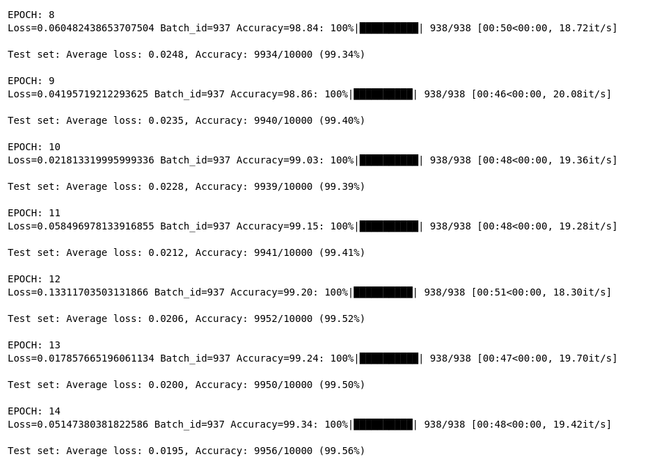

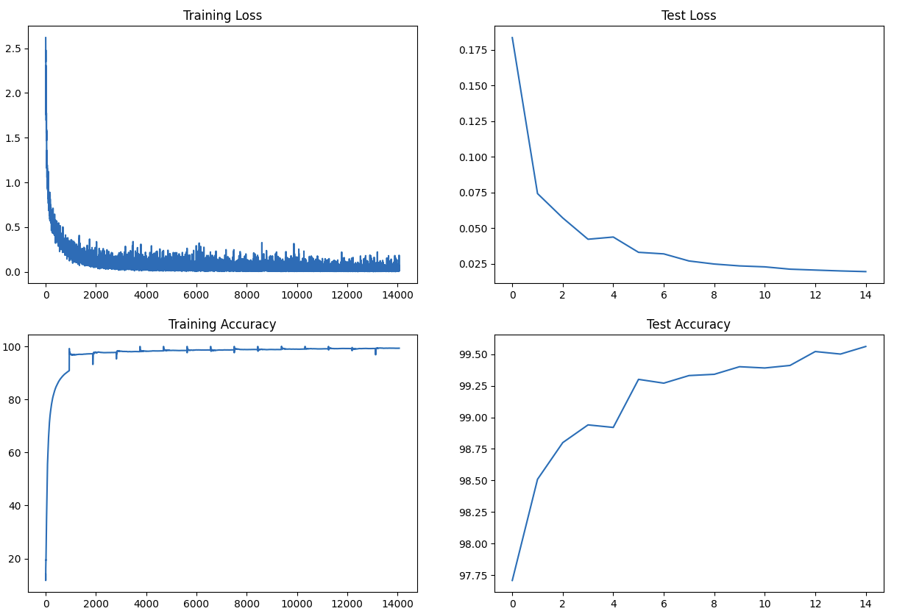